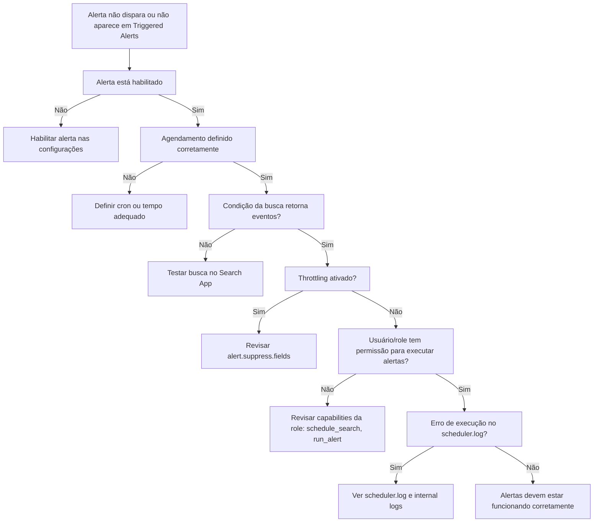

# Fluxo Visual – Core (Alertas não disparam ou não funcionam)

> 💡 Use este fluxo quando um alerta programado **não dispara**, **não aparece no histórico**, ou **nunca gera ação** mesmo com condições atendidas.

