# Fluxo Visual – Core (Alertas não disparam ou não funcionam)

```mermaid
graph TD
  A[Alerta não dispara ou não aparece em Triggered Alerts] --> B1[Alerta está habilitado]
  B1 -->|Não| F1[Habilitar alerta nas configurações]
  B1 -->|Sim| B2[Agendamento definido corretamente]
  B2 -->|Não| F2[Definir cron ou tempo adequado]
  B2 -->|Sim| B3[Condição da busca retorna eventos?]
  B3 -->|Não| F3[Testar busca no Search App]
  B3 -->|Sim| B4[Throttling ativado?]
  B4 -->|Sim| F4[Revisar alert.suppress.fields]
  B4 -->|Não| B5[Usuário/role tem permissão para executar alertas?]
  B5 -->|Não| F5[Revisar capabilities da role: schedule_search, run_alert]
  B5 -->|Sim| B6[Erro de execução no scheduler.log?]
  B6 -->|Sim| F6[Ver scheduler.log e internal logs]
  B6 -->|Não| G[Alertas devem estar funcionando corretamente]
```

> 💡 Use este fluxo quando um alerta programado **não dispara**, **não aparece no histórico**, ou **nunca gera ação** mesmo com condições atendidas.

