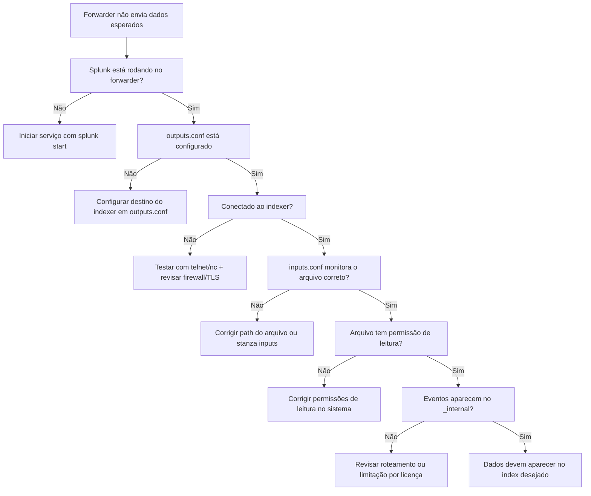

# Fluxo Visual – Core (Forwarder não envia dados)

```mermaid
graph TD
  A[Forwarder não envia dados esperados] --> B1[Splunk está rodando no forwarder?]
  B1 -->|Não| F1[Iniciar serviço com splunk start]
  B1 -->|Sim| B2[outputs.conf está configurado]
  B2 -->|Não| F2[Configurar destino do indexer em outputs.conf]
  B2 -->|Sim| B3[Conectado ao indexer?]
  B3 -->|Não| F3[Testar com telnet/nc + revisar firewall/TLS]
  B3 -->|Sim| B4[inputs.conf monitora o arquivo correto?]
  B4 -->|Não| F4[Corrigir path do arquivo ou stanza inputs]
  B4 -->|Sim| B5[Arquivo tem permissão de leitura?]
  B5 -->|Não| F5[Corrigir permissões de leitura no sistema]
  B5 -->|Sim| B6[Eventos aparecem no _internal?]
  B6 -->|Não| F6[Revisar roteamento ou limitação por licença]
  B6 -->|Sim| G[Dados devem aparecer no index desejado]
```

> 💡 Use este fluxo quando um **Universal Forwarder** não envia eventos, mesmo com inputs e outputs configurados.

