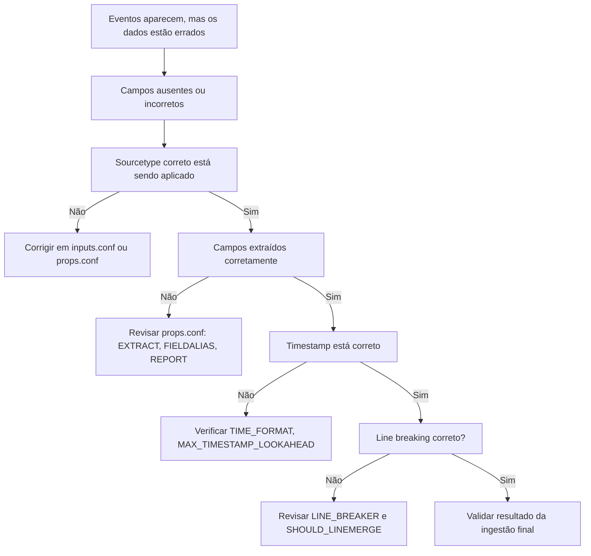

# Fluxo Visual – Core (Campos errados, sourcetype, timestamp)

> 💡 Use este fluxo quando os dados estão chegando, mas há erros em campos como `host`, `source`, `sourcetype`, `timestamp` ou extrações personalizadas.

