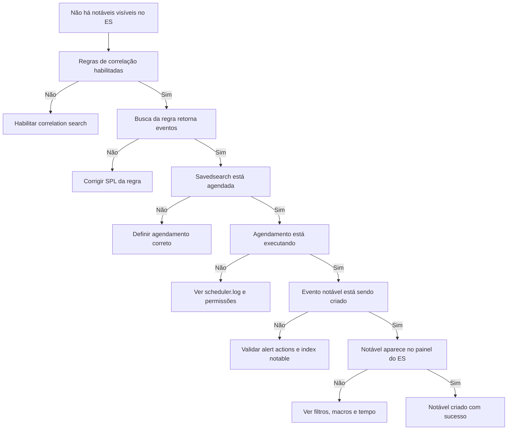

# Fluxo Visual – ES (Notáveis não sendo gerados)

```mermaid
graph TD
  A[Não há notáveis visíveis no ES] --> B1[Regras de correlação habilitadas]
  B1 -->|Não| F1[Habilitar correlation search]
  B1 -->|Sim| B2[Busca da regra retorna eventos]
  B2 -->|Não| F2[Corrigir SPL da regra]
  B2 -->|Sim| B3[Savedsearch está agendada]
  B3 -->|Não| F3[Definir agendamento correto]
  B3 -->|Sim| B4[Agendamento está executando]
  B4 -->|Não| F4[Ver scheduler.log e permissões]
  B4 -->|Sim| B5[Evento notável está sendo criado]
  B5 -->|Não| F5[Validar alert actions e index notable]
  B5 -->|Sim| B6[Notável aparece no painel do ES]
  B6 -->|Não| F6[Ver filtros, macros e tempo]
  B6 -->|Sim| G1[Notável criado com sucesso]
```

> 💡 Este fluxograma cobre as verificações essenciais para diagnosticar **por que um notável não está sendo criado no ES**.

