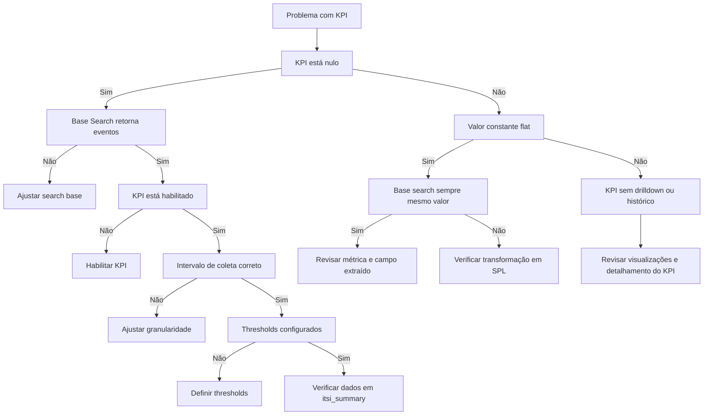

# Fluxo Visual – ITSI (KPIs não gerando valor)

```mermaid
graph TD
  A[Problema com KPI] --> B1[KPI está nulo]
  B1 -->|Sim| C1[Base Search retorna eventos]
  C1 -->|Não| F1[Ajustar search base]
  C1 -->|Sim| C2[KPI está habilitado]
  C2 -->|Não| F2[Habilitar KPI]
  C2 -->|Sim| C3[Intervalo de coleta correto]
  C3 -->|Não| F3[Ajustar granularidade]
  C3 -->|Sim| C4[Thresholds configurados]
  C4 -->|Não| F4[Definir thresholds]
  C4 -->|Sim| D[Verificar dados em itsi_summary]

  B1 -->|Não| B2[Valor constante flat]
  B2 -->|Sim| E1[Base search sempre mesmo valor]
  E1 -->|Sim| F5[Revisar métrica e campo extraído]
  E1 -->|Não| G1[Verificar transformação em SPL]

  B2 -->|Não| H1[KPI sem drilldown ou histórico]
  H1 --> F6[Revisar visualizações e detalhamento do KPI]
```

> 💡 Este fluxograma cobre os principais caminhos de troubleshooting para KPIs do ITSI que estão nulos, constantes ou não aparecem corretamente.

