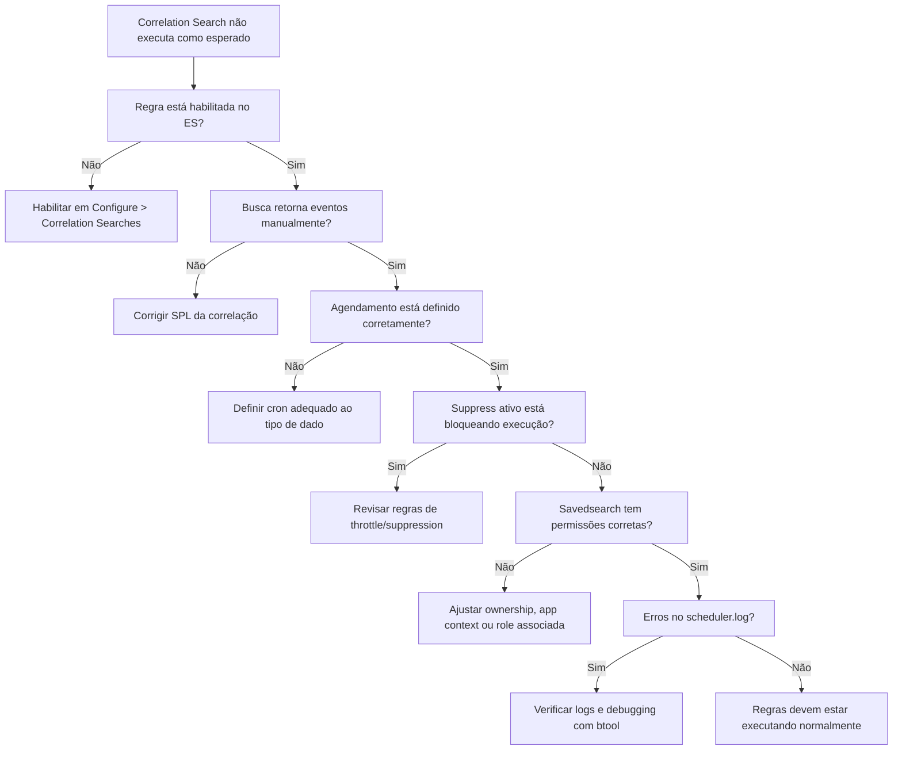

# Fluxo Visual – ES (Regras não disparam ou não executam)

```mermaid
graph TD
  A[Correlation Search não executa como esperado] --> B1[Regra está habilitada no ES?]
  B1 -->|Não| F1[Habilitar em Configure > Correlation Searches]
  B1 -->|Sim| B2[Busca retorna eventos manualmente?]
  B2 -->|Não| F2[Corrigir SPL da correlação]
  B2 -->|Sim| B3[Agendamento está definido corretamente?]
  B3 -->|Não| F3[Definir cron adequado ao tipo de dado]
  B3 -->|Sim| B4[Suppress ativo está bloqueando execução?]
  B4 -->|Sim| F4[Revisar regras de throttle/suppression]
  B4 -->|Não| B5[Savedsearch tem permissões corretas?]
  B5 -->|Não| F5[Ajustar ownership, app context ou role associada]
  B5 -->|Sim| B6[Erros no scheduler.log?]
  B6 -->|Sim| F6[Verificar logs e debugging com btool]
  B6 -->|Não| G[Regras devem estar executando normalmente]
```

> 💡 Use este fluxo quando uma **regra de correlação no ES está corretamente configurada, mas não dispara em produção**.

