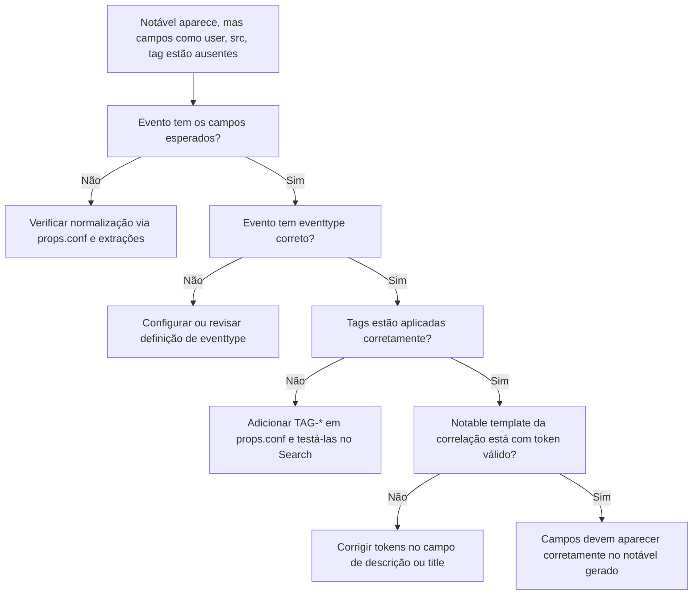

# Fluxo Visual – ES (Notáveis com campos ausentes ou errados)

```mermaid
graph TD
  A[Notável aparece, mas campos como user, src, tag estão ausentes] --> B1[Evento tem os campos esperados?]
  B1 -->|Não| F1[Verificar normalização via props.conf e extrações]
  B1 -->|Sim| B2[Evento tem eventtype correto?]
  B2 -->|Não| F2[Configurar ou revisar definição de eventtype]
  B2 -->|Sim| B3[Tags estão aplicadas corretamente?]
  B3 -->|Não| F3[Adicionar TAG-* em props.conf e testá-las no Search]
  B3 -->|Sim| B4[Notable template da correlação está com token válido?]
  B4 -->|Não| F4[Corrigir tokens no campo de descrição ou title]
  B4 -->|Sim| G[Campos devem aparecer corretamente no notável gerado]
```

> 💡 Use este fluxo para investigar **notáveis que aparecem nos painéis, mas estão com informações faltando ou mal formatadas**.

