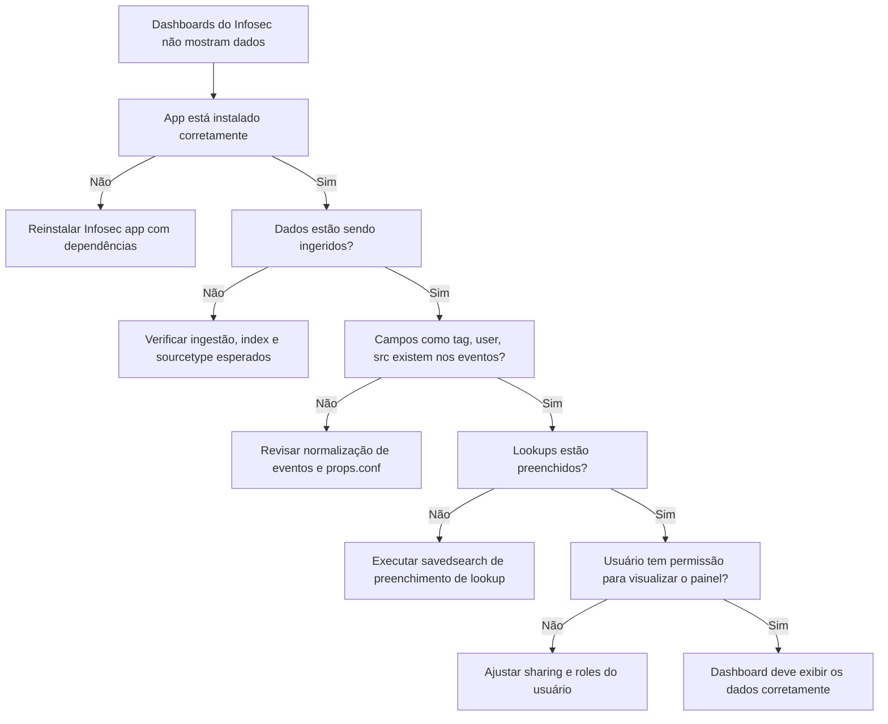

# Fluxo Visual – Infosec (Dashboards vazios)

```mermaid
graph TD
  A[Dashboards do Infosec não mostram dados] --> B1[App está instalado corretamente]
  B1 -->|Não| F1[Reinstalar Infosec app com dependências]
  B1 -->|Sim| B2[Dados estão sendo ingeridos?]
  B2 -->|Não| F2[Verificar ingestão, index e sourcetype esperados]
  B2 -->|Sim| B3[Campos como tag, user, src existem nos eventos?]
  B3 -->|Não| F3[Revisar normalização de eventos e props.conf]
  B3 -->|Sim| B4[Lookups estão preenchidos?]
  B4 -->|Não| F4[Executar savedsearch de preenchimento de lookup]
  B4 -->|Sim| B5[Usuário tem permissão para visualizar o painel?]
  B5 -->|Não| F5[Ajustar sharing e roles do usuário]
  B5 -->|Sim| G[Dashboard deve exibir os dados corretamente]
```

> 💡 Use este fluxo para investigar **painéis do Infosec que não apresentam eventos**, mesmo após ingestão de dados.
