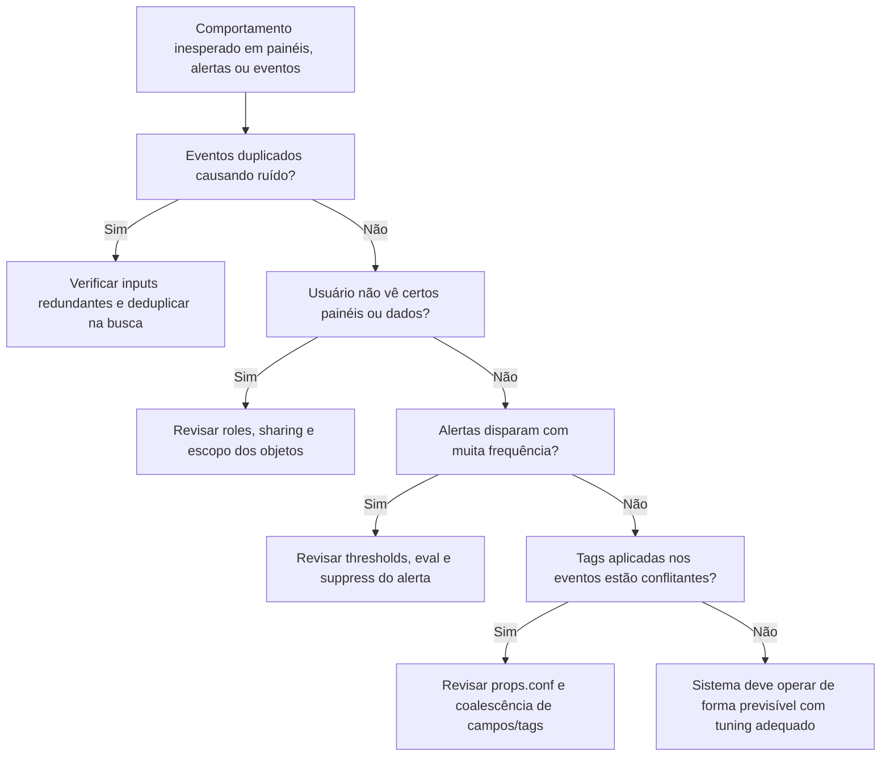

# Fluxo Visual – Infosec (Comportamentos inesperados e casos diversos)

> 💡 Use este fluxo para lidar com **situações anômalas ou inconsistentes no Infosec**, como alertas sensíveis demais, painéis incompletos ou eventos mal classificados.
