# Fluxo Visual – Infosec (Comportamentos inesperados e casos diversos)

```mermaid
graph TD
  A[Comportamento inesperado em painéis, alertas ou eventos] --> B1[Eventos duplicados causando ruído?]
  B1 -->|Sim| F1[Verificar inputs redundantes e deduplicar na busca]
  B1 -->|Não| B2[Usuário não vê certos painéis ou dados?]
  B2 -->|Sim| F2[Revisar roles, sharing e escopo dos objetos]
  B2 -->|Não| B3[Alertas disparam com muita frequência?]
  B3 -->|Sim| F3[Revisar thresholds, eval e suppress do alerta]
  B3 -->|Não| B4[Tags aplicadas nos eventos estão conflitantes?]
  B4 -->|Sim| F4[Revisar props.conf e coalescência de campos/tags]
  B4 -->|Não| G[Sistema deve operar de forma previsível com tuning adequado]
```

> 💡 Use este fluxo para lidar com **situações anômalas ou inconsistentes no Infosec**, como alertas sensíveis demais, painéis incompletos ou eventos mal classificados.
