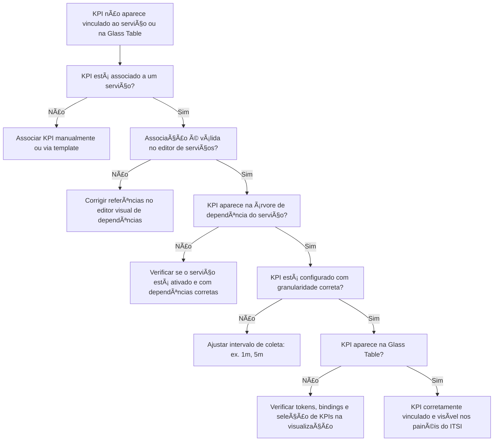

# Fluxo Visual – ITSI (Associação de KPI com Serviços)

```mermaid
graph TD
  A[KPI não aparece vinculado ao serviço ou na Glass Table] --> B1[KPI está associado a um serviço?]
  B1 -->|Não| F1[Associar KPI manualmente ou via template]
  B1 -->|Sim| B2[Associação é válida no editor de serviços?]
  B2 -->|Não| F2[Corrigir referências no editor visual de dependências]
  B2 -->|Sim| B3[KPI aparece na árvore de dependência do serviço?]
  B3 -->|Não| F3[Verificar se o serviço está ativado e com dependências corretas]
  B3 -->|Sim| B4[KPI está configurado com granularidade correta?]
  B4 -->|Não| F4[Ajustar intervalo de coleta: ex. 1m, 5m]
  B4 -->|Sim| B5[KPI aparece na Glass Table?]
  B5 -->|Não| F5[Verificar tokens, bindings e seleção de KPIs na visualização]
  B5 -->|Sim| G[KPI corretamente vinculado e visível nos painéis do ITSI]
```

> 💡 Use este fluxo quando um **KPI parece “perdido†ou ausente** da visualização do serviço, Glass Table ou painéis.
