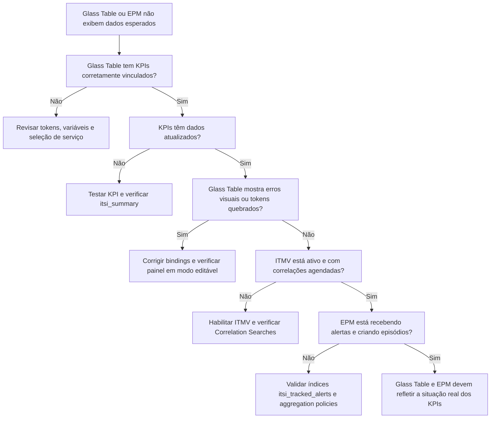

# Fluxo Visual – ITSI (Problemas com Glass Table, ITMV e EPM)

> 💡 Use este fluxo quando **a visualização na Glass Table está vazia**, tokens quebrados, ou o **EPM não agrega eventos como esperado**.
