# Fluxo Visual – ITSI (Problemas com Glass Table, ITMV e EPM)

```mermaid
graph TD
  A[Glass Table ou EPM não exibem dados esperados] --> B1[Glass Table tem KPIs corretamente vinculados?]
  B1 -->|Não| F1[Revisar tokens, variáveis e seleção de serviço]
  B1 -->|Sim| B2[KPIs têm dados atualizados?]
  B2 -->|Não| F2[Testar KPI e verificar itsi_summary]
  B2 -->|Sim| B3[Glass Table mostra erros visuais ou tokens quebrados?]
  B3 -->|Sim| F3[Corrigir bindings e verificar painel em modo editável]
  B3 -->|Não| B4[ITMV está ativo e com correlações agendadas?]
  B4 -->|Não| F4[Habilitar ITMV e verificar Correlation Searches]
  B4 -->|Sim| B5[EPM está recebendo alertas e criando episódios?]
  B5 -->|Não| F5[Validar índices itsi_tracked_alerts e aggregation policies]
  B5 -->|Sim| G[Glass Table e EPM devem refletir a situação real dos KPIs]
```

> 💡 Use este fluxo quando **a visualização na Glass Table está vazia**, tokens quebrados, ou o **EPM não agrega eventos como esperado**.
