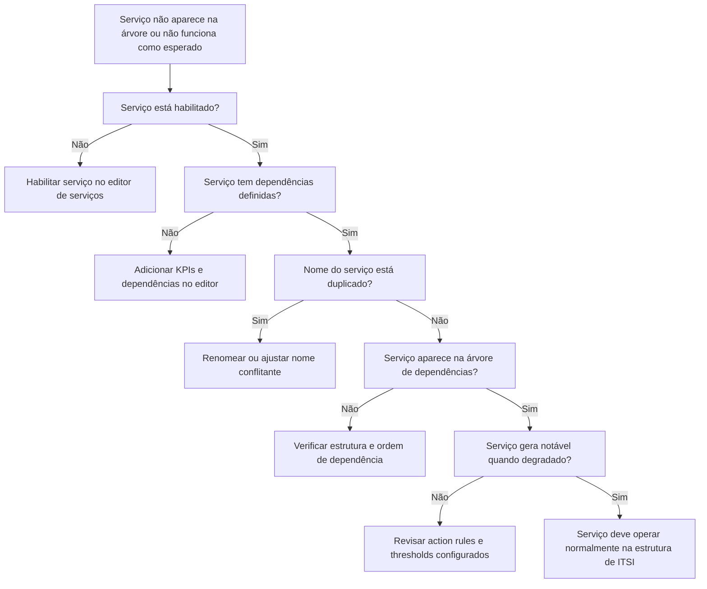

# Fluxo Visual – ITSI (Serviços inconsistentes ou ausentes)

```mermaid
graph TD
  A[Serviço não aparece na árvore ou não funciona como esperado] --> B1[Serviço está habilitado?]
  B1 -->|Não| F1[Habilitar serviço no editor de serviços]
  B1 -->|Sim| B2[Serviço tem dependências definidas?]
  B2 -->|Não| F2[Adicionar KPIs e dependências no editor]
  B2 -->|Sim| B3[Nome do serviço está duplicado?]
  B3 -->|Sim| F3[Renomear ou ajustar nome conflitante]
  B3 -->|Não| B4[Serviço aparece na árvore de dependências?]
  B4 -->|Não| F4[Verificar estrutura e ordem de dependência]
  B4 -->|Sim| B5[Serviço gera notável quando degradado?]
  B5 -->|Não| F5[Revisar action rules e thresholds configurados]
  B5 -->|Sim| G[Serviço deve operar normalmente na estrutura de ITSI]
```

> 💡 Use este fluxo quando um **serviço ITSI não aparece na árvore**, está vazio ou não responde à degradação esperada.
