# Fluxo Visual – Core (Campos errados, sourcetype, timestamp)

```mermaid
graph TD
  A[Eventos aparecem, mas os dados estão errados] --> B1[Campos ausentes ou incorretos]
  B1 --> C1[Sourcetype correto está sendo aplicado]
  C1 -->|Não| F1[Corrigir em inputs.conf ou props.conf]
  C1 -->|Sim| C2[Campos extraídos corretamente]
  C2 -->|Não| F2[Revisar props.conf: EXTRACT, FIELDALIAS, REPORT]
  C2 -->|Sim| C3[Timestamp está correto]
  C3 -->|Não| F3[Verificar TIME_FORMAT, MAX_TIMESTAMP_LOOKAHEAD]
  C3 -->|Sim| C4[Line breaking correto?]
  C4 -->|Não| F4[Revisar LINE_BREAKER e SHOULD_LINEMERGE]
  C4 -->|Sim| D[Validar resultado da ingestão final]
```

> 💡 Use este fluxo quando os dados estão chegando, mas há erros em campos como `host`, `source`, `sourcetype`, `timestamp` ou extrações personalizadas.

