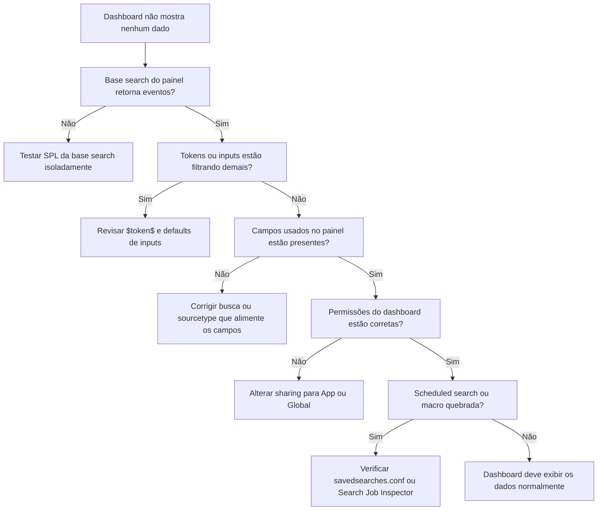

# Fluxo Visual – Core (Dashboards vazios)

```mermaid
graph TD
  A[Dashboard não mostra nenhum dado] --> B1[Base search do painel retorna eventos?]
  B1 -->|Não| F1[Testar SPL da base search isoladamente]
  B1 -->|Sim| B2[Tokens ou inputs estão filtrando demais?]
  B2 -->|Sim| F2[Revisar $token$ e defaults de inputs]
  B2 -->|Não| B3[Campos usados no painel estão presentes?]
  B3 -->|Não| F3[Corrigir busca ou sourcetype que alimente os campos]
  B3 -->|Sim| B4[Permissões do dashboard estão corretas?]
  B4 -->|Não| F4[Alterar sharing para App ou Global]
  B4 -->|Sim| B5[Scheduled search ou macro quebrada?]
  B5 -->|Sim| F5[Verificar savedsearches.conf ou Search Job Inspector]
  B5 -->|Não| G[Dashboard deve exibir os dados normalmente]
```

> 💡 Este fluxo ajuda a diagnosticar **dashboards que aparecem em branco**, mesmo com ingestão de dados e indexação funcionando corretamente.
