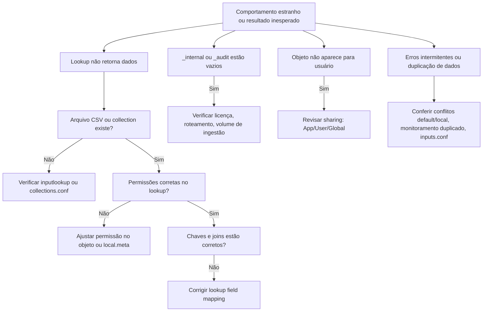

# Fluxo Visual – Core (Lookups, permissões e problemas diversos)

```mermaid
graph TD
  A[Comportamento estranho ou resultado inesperado] --> B1[Lookup não retorna dados]
  B1 --> C1[Arquivo CSV ou collection existe?]
  C1 -->|Não| F1[Verificar inputlookup ou collections.conf]
  C1 -->|Sim| C2[Permissões corretas no lookup?]
  C2 -->|Não| F2[Ajustar permissão no objeto ou local.meta]
  C2 -->|Sim| C3[Chaves e joins estão corretos?]
  C3 -->|Não| F3[Corrigir lookup field mapping]

  A --> B2[_internal ou _audit estão vazios]
  B2 -->|Sim| F4[Verificar licença, roteamento, volume de ingestão]

  A --> B3[Objeto não aparece para usuário]
  B3 -->|Sim| F5[Revisar sharing: App/User/Global]

  A --> B4[Erros intermitentes ou duplicação de dados]
  B4 --> F6[Conferir conflitos default/local, monitoramento duplicado, inputs.conf]
```

> 💡 Use este fluxo para tratar situações menos frequentes ou mais específicas envolvendo lookups, permissões e logs internos.

