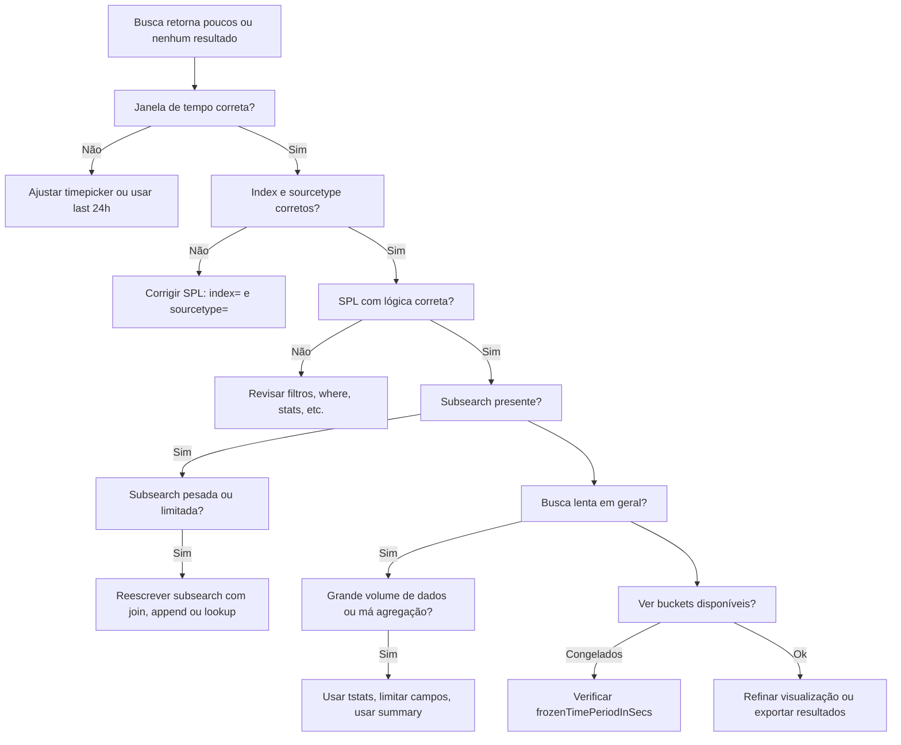

# Fluxo Visual – Core (Busca lenta ou sem retorno)

> 💡 Use este fluxo quando a **busca SPL** retorna zero resultados ou apresenta lentidão excessiva. Ideal para revisar lógica, escopo de dados e performance.

