# Fluxo Visual – Core (Busca lenta ou sem retorno)

```mermaid
graph TD
  A[Busca retorna poucos ou nenhum resultado] --> B1[Janela de tempo correta?]
  B1 -->|Não| F1[Ajustar timepicker ou usar last 24h]
  B1 -->|Sim| B2[Index e sourcetype corretos?]
  B2 -->|Não| F2[Corrigir SPL: index= e sourcetype=]
  B2 -->|Sim| B3[SPL com lógica correta?]
  B3 -->|Não| F3[Revisar filtros, where, stats, etc.]
  B3 -->|Sim| B4[Subsearch presente?]
  B4 -->|Sim| C1[Subsearch pesada ou limitada?]
  C1 -->|Sim| F4[Reescrever subsearch com join, append ou lookup]
  B4 --> B5[Busca lenta em geral?]
  B5 -->|Sim| C2[Grande volume de dados ou má agregação?]
  C2 -->|Sim| F5[Usar tstats, limitar campos, usar summary]
  B5 --> C3[Ver buckets disponíveis?]
  C3 -->|Congelados| F6[Verificar frozenTimePeriodInSecs]
  C3 -->|Ok| D[Refinar visualização ou exportar resultados]
```

> 💡 Use este fluxo quando a **busca SPL** retorna zero resultados ou apresenta lentidão excessiva. Ideal para revisar lógica, escopo de dados e performance.

