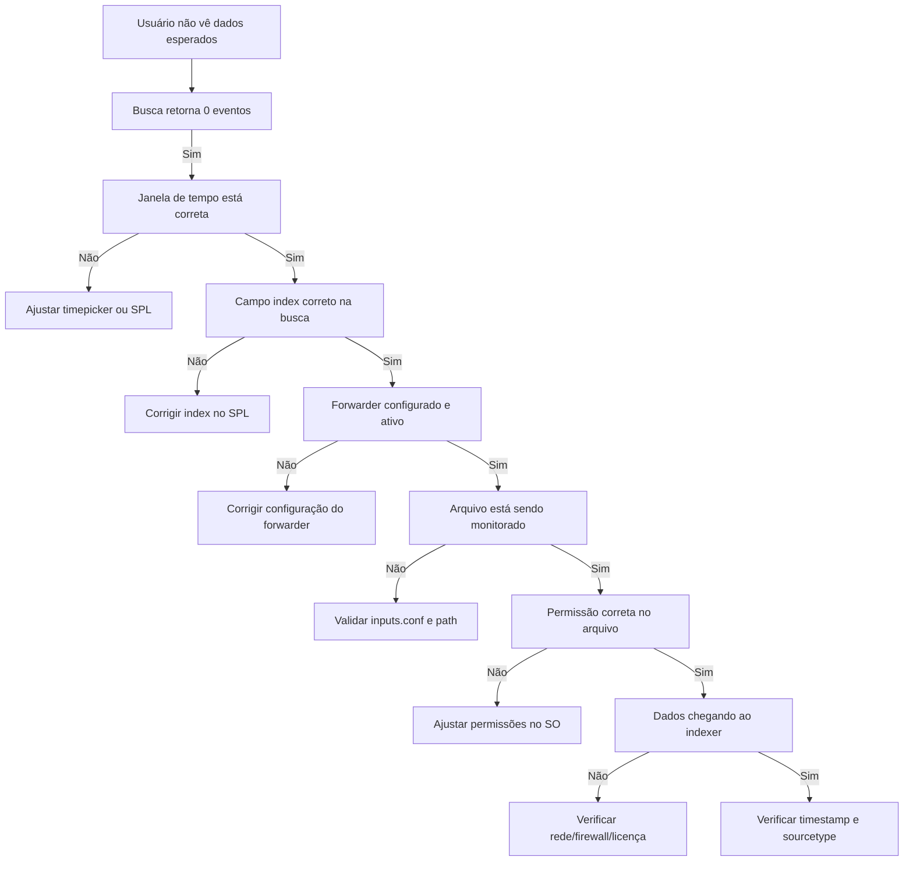

# Fluxo Visual – Core (Dados não aparecem no index)

```mermaid
graph TD
  A[Usuário não vê dados esperados] --> B1[Busca retorna 0 eventos]
  B1 -->|Sim| C1[Janela de tempo está correta]
  C1 -->|Não| F1[Ajustar timepicker ou SPL]
  C1 -->|Sim| C2[Campo index correto na busca]
  C2 -->|Não| F2[Corrigir index no SPL]
  C2 -->|Sim| D1[Forwarder configurado e ativo]
  D1 -->|Não| F3[Corrigir configuração do forwarder]
  D1 -->|Sim| D2[Arquivo está sendo monitorado]
  D2 -->|Não| F4[Validar inputs.conf e path]
  D2 -->|Sim| D3[Permissão correta no arquivo]
  D3 -->|Não| F5[Ajustar permissões no SO]
  D3 -->|Sim| D4[Dados chegando ao indexer]
  D4 -->|Não| F6[Verificar rede/firewall/licença]
  D4 -->|Sim| E1[Verificar timestamp e sourcetype]
```

> 💡 Este fluxograma ajuda a investigar a ausência de dados no index do Splunk Core, desde a busca até a ingestão.

