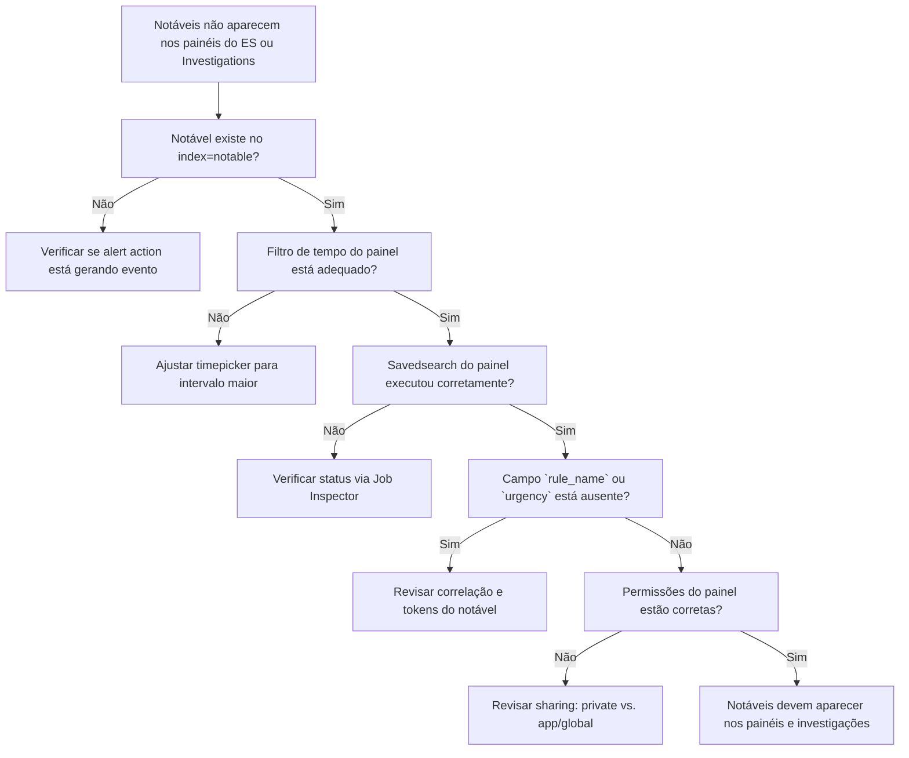

# Fluxo Visual – ES (Painéis e investigações não mostram notáveis)

```mermaid
graph TD
  A[Notáveis não aparecem nos painéis do ES ou Investigations] --> B1[Notável existe no index=notable?]
  B1 -->|Não| F1[Verificar se alert action está gerando evento]
  B1 -->|Sim| B2[Filtro de tempo do painel está adequado?]
  B2 -->|Não| F2[Ajustar timepicker para intervalo maior]
  B2 -->|Sim| B3[Savedsearch do painel executou corretamente?]
  B3 -->|Não| F3[Verificar status via Job Inspector]
  B3 -->|Sim| B4[Campo `rule_name` ou `urgency` está ausente?]
  B4 -->|Sim| F4[Revisar correlação e tokens do notável]
  B4 -->|Não| B5[Permissões do painel estão corretas?]
  B5 -->|Não| F5[Revisar sharing: private vs. app/global]
  B5 -->|Sim| G[Notáveis devem aparecer nos painéis e investigações]
```

> 💡 Use este fluxo quando **notáveis existem, mas não são exibidos nos painéis do ES ou nas timelines de investigação**.
