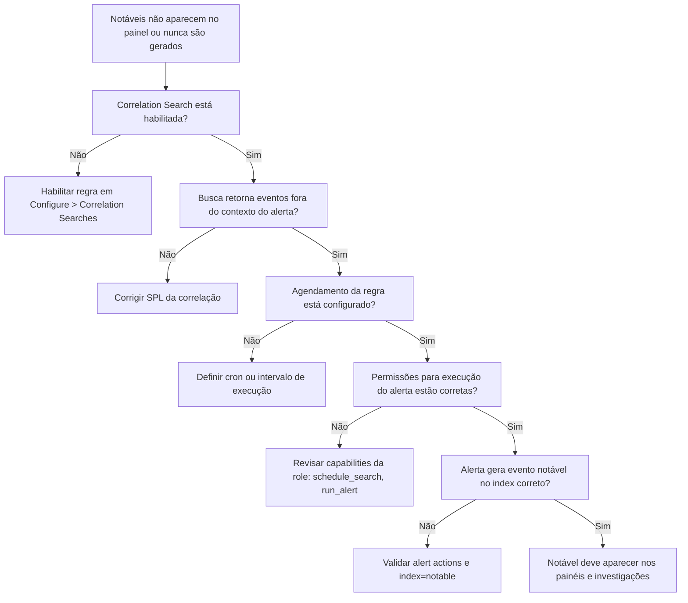

# Fluxo Visual – ES (Notáveis ausentes ou não gerados)

```mermaid
graph TD
  A[Notáveis não aparecem no painel ou nunca são gerados] --> B1[Correlation Search está habilitada?]
  B1 -->|Não| F1[Habilitar regra em Configure > Correlation Searches]
  B1 -->|Sim| B2[Busca retorna eventos fora do contexto do alerta?]
  B2 -->|Não| F2[Corrigir SPL da correlação]
  B2 -->|Sim| B3[Agendamento da regra está configurado?]
  B3 -->|Não| F3[Definir cron ou intervalo de execução]
  B3 -->|Sim| B4[Permissões para execução do alerta estão corretas?]
  B4 -->|Não| F4[Revisar capabilities da role: schedule_search, run_alert]
  B4 -->|Sim| B5[Alerta gera evento notável no index correto?]
  B5 -->|Não| F5[Validar alert actions e index=notable]
  B5 -->|Sim| G[Notável deve aparecer nos painéis e investigações]
```

> 💡 Use este fluxo para investigar **por que um notável do Splunk ES não está sendo gerado**, mesmo com eventos e correlação ativa.
