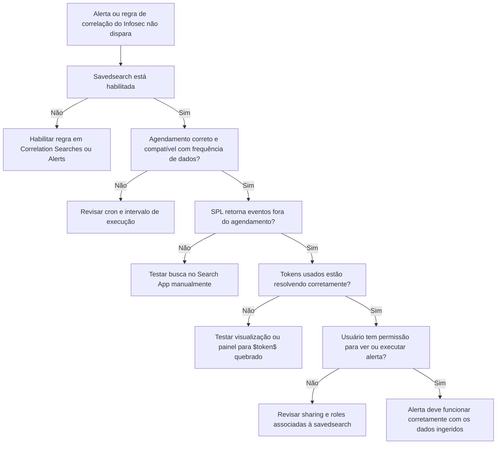

# Fluxo Visual – Infosec (Alertas, tokens ou agendamento)

```mermaid
graph TD
  A[Alerta ou regra de correlação do Infosec não dispara] --> B1[Savedsearch está habilitada]
  B1 -->|Não| F1[Habilitar regra em Correlation Searches ou Alerts]
  B1 -->|Sim| B2[Agendamento correto e compatível com frequência de dados?]
  B2 -->|Não| F2[Revisar cron e intervalo de execução]
  B2 -->|Sim| B3[SPL retorna eventos fora do agendamento?]
  B3 -->|Não| F3[Testar busca no Search App manualmente]
  B3 -->|Sim| B4[Tokens usados estão resolvendo corretamente?]
  B4 -->|Não| F4[Testar visualização ou painel para $token$ quebrado]
  B4 -->|Sim| B5[Usuário tem permissão para ver ou executar alerta?]
  B5 -->|Não| F5[Revisar sharing e roles associadas à savedsearch]
  B5 -->|Sim| G[Alerta deve funcionar corretamente com os dados ingeridos]
```

> 💡 Use este fluxo para investigar **por que alertas do Infosec não disparam**, mesmo com eventos e condições aparentes.
