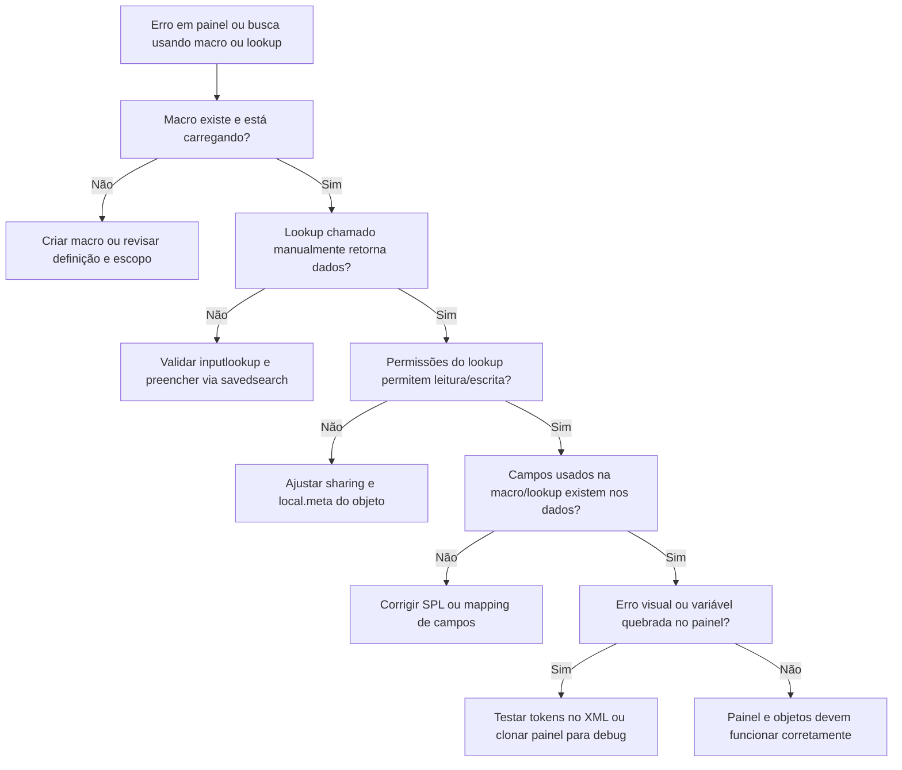

# Fluxo Visual – Infosec (Macros, lookups e painéis)

```mermaid
graph TD
  A[Erro em painel ou busca usando macro ou lookup] --> B1[Macro existe e está carregando?]
  B1 -->|Não| F1[Criar macro ou revisar definição e escopo]
  B1 -->|Sim| B2[Lookup chamado manualmente retorna dados?]
  B2 -->|Não| F2[Validar inputlookup e preencher via savedsearch]
  B2 -->|Sim| B3[Permissões do lookup permitem leitura/escrita?]
  B3 -->|Não| F3[Ajustar sharing e local.meta do objeto]
  B3 -->|Sim| B4[Campos usados na macro/lookup existem nos dados?]
  B4 -->|Não| F4[Corrigir SPL ou mapping de campos]
  B4 -->|Sim| B5[Erro visual ou variável quebrada no painel?]
  B5 -->|Sim| F5[Testar tokens no XML ou clonar painel para debug]
  B5 -->|Não| G[Painel e objetos devem funcionar corretamente]
```

> 💡 Use este fluxo para investigar **falhas em macros, lookups e painéis customizados** do Infosec.
